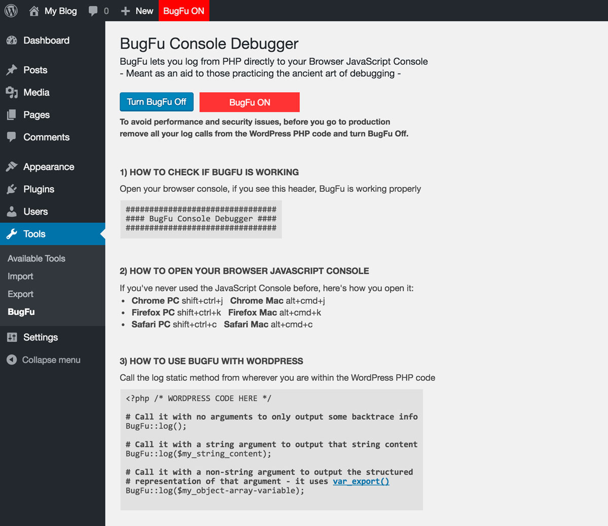

# BugFu Console Debugger - WordPress Plugin

## Official URL
Download it from the WordPress plugin directory:  
https://wordpress.org/plugins/bugfu-console-debugger/

## Description
Log from PHP directly to your Browser JavaScript Console.  
BugFu is meant as an aid to those practicing the ancient art of debugging.

## How to check if BugFu is working
Open your browser console, if you see this header, BugFu is working properly
```
################################
#### BugFu Console Debugger ####
################################
```

## How to open your Browser JavaScript Console
If you've never used the JavaScript Console before, here's how you open it:
* Chrome PC shift+ctrl+j - Chrome Mac alt+cmd+j
* Firefox PC shift+ctrl+k - Firefox Mac alt+cmd+k
* Safari PC shift+ctrl+c - Safari Mac alt+cmd+c

## How to use BugFu with WordPress
Call the log static method from wherever you are within the WordPress PHP code
```
<?php /* WORDPRESS CODE HERE */

# Call it with no arguments to only output some backtrace info
BugFu::log();

# Call it with a string argument to output that string content
BugFu::log($my_string_content);

# Call it with a non-string argument to output the structured
# representation of that argument - it uses var_export() 
BugFu::log($my_object-array-variable);

# Call it with the second optional argument set to "false"
# to turn off the backtrace info (which is on by default) 
BugFu::log($my_content, false);
```

## Interface screenshots

### The admin page when BugFu is ON  


### The Browser JavaScript Console when BugFu is ON  


### The admin page when BugFu is OFF  


## License
The BugFu Console Debugger plugin is licensed under the GPL v2 or later:  
http://www.gnu.org/licenses/gpl-2.0.html

